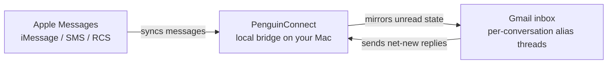

# PenguinConnect

[](./docs/PENGUIN_CONNECT.md)
[](./SECURITY.md)
[](./server/requirements.txt)
[](./LICENSE)

PenguinConnect turns Gmail into a control surface for messaging conversations while keeping messaging-side access on your Mac. Today it bridges Gmail with Apple Messages (`iMessage`, `SMS`, `RCS`); the runtime is macOS-only and binds to `127.0.0.1`.



## Why PenguinConnect

- Keep Apple Messages access local instead of pushing `chat.db` into a hosted service.
- Work from Gmail threads and per-conversation alias addresses.
- Preserve safe routing rules: if Apple Messages route resolution is ambiguous, PenguinConnect does not send.

## Current Status

- Shipping source adapter: Apple Messages
- Apple Messages services supported now: `iMessage`, `SMS`, `RCS`
- Shared inbox surface: Gmail
- Planned next adapters: WhatsApp, Telegram
- Runtime: macOS 13+, Python 3.11+, `Terminal.app` with Full Disk Access

## Highlights

- Two-way sync between Apple Messages conversations and Gmail threads
- One active alias email per conversation
- Direct-message unification across sibling `iMessage`, `SMS`, and `RCS` routes
- Group chats stay separate per exact Apple Messages chat
- Gmail-to-chat delivery sends net-new text only and strips quoted history aggressively
- Gmail `UNREAD` labels mirror Apple Messages unread state at the conversation level
- Durable local SQLite queue and JSONL action log survive process restarts
- Ambiguous parsed replies are rejected visibly in Gmail instead of failing silently

## Quick Start

1. Copy `.env.example` to `.env`.
2. Install backend dependencies.
3. Run guided setup.
4. Start the bridge.
5. Run verification.

```bash
cp .env.example .env

cd server
python3 -m venv venv
venv/bin/pip install -r requirements.txt
cd ..
```

```bash
./scripts/penguin_connect_setup.py --gmail you@gmail.com
./scripts/run_penguin_connect_bridge.sh
./scripts/check.sh
```

During guided setup, the wizard also offers an interactive Apple Messages chat exclusion step and saves selections in `./.penguin_connect_excluded_chats.json` by default.

Important: run setup and bridge commands from `Terminal.app` with Full Disk Access enabled, otherwise Apple Messages `chat.db` reads will fail.

## Useful Commands

Start the bridge:

```bash
./scripts/run_penguin_connect_bridge.sh
```

Alternative start wrapper:

```bash
./start.sh
```

Health check:

```bash
curl -s http://127.0.0.1:9000/penguin-connect/health | jq
```

Production-style preflight:

```bash
./scripts/check.sh
./scripts/penguin_connect_doctor.py
```

Quote-parsing audit:

```bash
./scripts/penguin_connect_audit_quote_parsing.py --limit 100
```

Manage excluded Apple Messages chats:

```bash
./scripts/penguin_connect_excluded_chats.py
```

## Safety Model

- Local-only runtime on `127.0.0.1`
- `conversation_id` is the primary logical identity
- Apple Messages direct messages may unify across sibling routes; group chats stay separate
- Exact Apple Messages route resolution must succeed before send
- Gmail-to-chat parsing fails closed when reply text is still ambiguous
- Action logging stores identifiers, timestamps, statuses, and message fingerprints, not raw message text

The default action log path is `~/penguinconnect-local-bridge-data/actions.jsonl`.

## Optional Reply Cleanup Markers

Set `PENGUIN_CONNECT_SIGNATURE_MARKERS_FILE` to point at a local JSON file with custom signature or disclaimer prefixes. If unset, PenguinConnect reads `./.penguin_connect_signature_markers.json` by default. An example file lives at [`signature_markers.example.json`](./signature_markers.example.json).

## Optional Chat Exclusions

Set `PENGUIN_CONNECT_EXCLUDED_CHATS_FILE` to point at a local JSON file with Apple Messages chats or logical conversations that PenguinConnect should skip. If unset, PenguinConnect reads `./.penguin_connect_excluded_chats.json` by default. An example file lives at [`excluded_chats.example.json`](./excluded_chats.example.json), and the interactive manager is [`scripts/penguin_connect_excluded_chats.py`](./scripts/penguin_connect_excluded_chats.py).

## Repository Guide

- Full setup, troubleshooting, and operations: [`docs/PENGUIN_CONNECT.md`](./docs/PENGUIN_CONNECT.md)
- Contributing guide: [`CONTRIBUTING.md`](./CONTRIBUTING.md)
- Security reporting: [`SECURITY.md`](./SECURITY.md)
- Code of conduct: [`CODE_OF_CONDUCT.md`](./CODE_OF_CONDUCT.md)
- Agent instructions: [`AGENTS.md`](./AGENTS.md)
- License: [`LICENSE`](./LICENSE)

## Project Layout

- [`server/`](./server): FastAPI app, sync logic, local DB, tests
- [`server/channels/`](./server/channels): provider adapters; Apple Messages is implemented today
- [`scripts/`](./scripts): setup, doctor, sync, audit, and launch helpers
- [`docs/`](./docs): setup, troubleshooting, and operations notes
- [`skills/`](./skills): repo-local guidance for coding agents and future channel integrations
