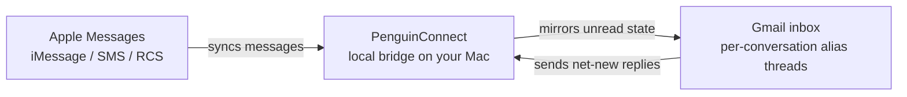

# PenguinConnect

[](./docs/PENGUIN_CONNECT.md)
[](./SECURITY.md)
[](./server/requirements.txt)
[](./LICENSE)

PenguinConnect turns Gmail into a control surface for messaging conversations while keeping messaging-side access on your Mac. Today it bridges Gmail with Apple Messages (`iMessage`, `SMS`, `RCS`); the runtime is macOS-only and binds to `127.0.0.1`.

Built as part of [Slashy](https://slashy.com) — an AI-native email client — so that Slashy has context on your text conversations too, not just email.


```mermaid
flowchart LR
    Messages["Apple Messages<br/>iMessage / SMS / RCS"] -->|syncs messages| Bridge["PenguinConnect<br/>local bridge on your Mac"]
    Bridge -->|mirrors unread state| Gmail["Gmail inbox<br/>per-conversation alias threads"]
    Gmail -->|sends net-new replies| Bridge
```

## Demo

<video src="https://github.com/hgaddipati1118/penguin-connect/raw/main/assets/PenguinConnect.mp4" controls width="100%"></video>

## Why PenguinConnect

I wanted a way to interact with my text messages from email. Email is already where work happens — why not bring messages there too?

- **AI needs full context.** Email alone misses half the picture — important conversations happen over iMessage, SMS, and RCS. PenguinConnect brings them into Gmail so tools like [Slashy](https://slashy.com) can reason across both channels.
- **Bidirectional sync unlocks cloud AI safely.** Because the bridge runs locally and syncs to your own Gmail, cloud-based AI tools can read and send messages through email without ever needing direct access to your messaging apps — no security vulnerability, no API keys to messaging services, no sensitive data in third-party systems.
- **Your messages stay on your Mac.** No hosted service ever touches `chat.db`. The bridge runs on `127.0.0.1` and syncs to your own Gmail account.
- **Work from Gmail threads** with per-conversation alias addresses — read, reply, and manage messages from one place.
- **Safe routing.** If Apple Messages route resolution is ambiguous, PenguinConnect does not send.

## Current Status

- Shipping source adapter: **Apple Messages** (`iMessage`, `SMS`, `RCS`)
- Shared inbox surface: **Gmail**
- Planned next adapters: **WhatsApp**, **Telegram**, and more
- Runtime: macOS 13+, Python 3.11+, `Terminal.app` with Full Disk Access

Want to help add a new messaging adapter or improve the bridge? Reach out at [harsha@slashy.com](mailto:harsha@slashy.com) or open an issue.

## Highlights

- Two-way sync between Apple Messages conversations and Gmail threads
- One active alias email per conversation
- Direct-message unification across sibling `iMessage`, `SMS`, and `RCS` routes
- Group chats stay separate per exact Apple Messages chat
- Incremental sync prioritizes currently active conversations while startup catch-up stays in background batches
- Gmail-to-chat delivery sends net-new text only and strips quoted history aggressively
- Gmail `UNREAD` labels mirror Apple Messages unread state at the conversation level
- Durable local SQLite queue and JSONL action log survive process restarts
- Ambiguous parsed replies are rejected visibly in Gmail instead of failing silently

## Quick Start

1. Copy `.env.example` to `.env`.
2. Install backend dependencies.
3. Run guided setup.
4. Start the bridge.
5. Run verification.

```bash
cp .env.example .env

cd server
python3 -m venv venv
venv/bin/pip install -r requirements.txt
cd ..
```

```bash
./scripts/penguin_connect_setup.py --gmail you@gmail.com
./scripts/run_penguin_connect_bridge.sh
./scripts/check.sh
```

During guided setup, the wizard also offers an interactive Apple Messages chat exclusion step and saves selections in `./.penguin_connect_excluded_chats.json` by default.

Important: run setup and bridge commands from `Terminal.app` with Full Disk Access enabled, otherwise Apple Messages `chat.db` reads will fail.

## Useful Commands

Start the bridge:

```bash
./scripts/run_penguin_connect_bridge.sh
```

Alternative start wrapper:

```bash
./start.sh
```

Health check:

```bash
curl -s http://127.0.0.1:9000/penguin-connect/health | jq
```

Operational note:
- Leave `PENGUIN_CONNECT_INCREMENTAL_CONVERSATIONS_PER_RUN` unset to let incremental runs expand to all currently hot conversations up to the built-in cap.
- Set `PENGUIN_CONNECT_INCREMENTAL_CONVERSATIONS_PER_RUN` if you want to clamp each incremental batch manually.
- Startup catch-up runs in small background batches so recent-message incremental sync can keep getting worker time.
- While startup catch-up or backfill is importing iMessage history, the worker now yields after every 5 Gmail imports if a queued incremental job is waiting.
- Preempted startup/backfill conversation imports resume from the saved Apple Messages cursor instead of rescanning from the beginning.
- Gmail writes now flow through a per-account quota budget, and startup/backfill can only spend the smaller backfill bucket so incremental work keeps reserved headroom.
- Repeated Gmail rate limits now slow startup/backfill automatically by extending the cooldown window and increasing the per-write pause until successful syncs recover.
- Startup/backfill also stop after a rolling 24-hour Gmail import cap and stand down for a longer pause once the Gmail rate-limit streak gets too high, so old-history catch-up cannot keep hammering the account while incremental work waits.

Production-style preflight:

```bash
./scripts/check.sh
./scripts/penguin_connect_doctor.py
```

Install login auto-start plus a start-only watchdog:

```bash
./scripts/install_launchd_penguin_connect_bridge.sh
```

That installer now sets up a launchd watchdog that runs at login and every 5 minutes, starting the bridge in `Terminal.app` only when nothing is listening on the configured local port. It never kills a running bridge, so Gmail cooldowns or temporary health warnings do not trigger restarts. If you later change `PENGUIN_CONNECT_PORT`, rerun the installer so the watchdog follows the new port.

Quote-parsing audit:

```bash
./scripts/penguin_connect_audit_quote_parsing.py --limit 100
```

Manage excluded Apple Messages chats:

```bash
./scripts/penguin_connect_excluded_chats.py
```

Local operator CLI for search, messages, sends, contacts, and group drafts:

```bash
open http://127.0.0.1:9000/penguin-connect/ui
./scripts/penguin_connect_tool.py status
./scripts/penguin_connect_tool.py search "Taylor" --source both
./scripts/penguin_connect_tool.py message-search "dinner plan" --source both
./scripts/penguin_connect_tool.py messages CONVERSATION_ID --limit 25
./scripts/penguin_connect_tool.py send CONVERSATION_ID --message "On it"
./scripts/penguin_connect_tool.py send CONVERSATION_ID --attachment ~/Desktop/voice-memo.m4a
./scripts/penguin_connect_tool.py contacts search "Taylor"
./scripts/penguin_connect_tool.py contacts create --first Taylor --phone +14155550101
./scripts/penguin_connect_tool.py contacts refresh
./scripts/penguin_connect_tool.py group compose --participant +14155550101 --participant friend@example.com --message "Starting this thread" --copy --open-addressed
```

The `send` command routes directly through an existing PenguinConnect conversation
and keeps the normal Apple Messages route-safety checks; Gmail is not required
for local manual sends. It can also attach local files, including audio voice
memos. The local UI supports replies, file/image attachments from picker, drag/drop, or paste, in-composer
voice memo recording, emoji
shortcuts, visible-page auto-refresh with new-activity status for cached conversations
and the selected thread, message-level reply targets and copy actions, thread filtering and sorting,
needs-reply/unread/drafts/unlabeled/muted/pinned/archived and label-based conversation views, bulk
mark-read/mark-unread/pin-unpin/mute-unmute/archive-restore/label add-remove, selected-thread summary copy, selected-people add/copy/save/create, and draft cleanup actions, latest-message previews in the conversation rail,
highlighted conversation search with saved rail views,
global synced-message search with saved message-search views and highlighted note/attachment-aware results, recent-message browsing, open/copy/reply actions and filters for current thread, unread, sent,
files and audio plus date ranges, highlighted loaded-message filters for sender/body/notes/attachments and unread/sent/files/audio,
starred/noted-message filtering, local message starring and private
message notes, per-message read/unread toggles, sender-history Find and thread-filter actions, visible loaded-message copy and bulk star/read/unread actions, opening synced attachment files, a per-thread media browser for loaded
images/audio/files, inline previews for local image attachments, inline playback
for local audio attachments, highlighted cached Contacts search/refresh with saved/unsaved/threaded/unread/favorite/noted
source filters with counts, contact thread and unread activity metadata, contact sorting including threads-first triage, saved contact-search views, all/saved/unsaved contact browsing, conversation-participant fallback and related-thread shortcuts with unread/source context,
thread-name, cached-message, and local-management-aware contact/participant search with highlighted related-thread label/note/message context, contact-to-thread rail filtering and matching-message focus, private contact notes with note-aware search, contact creation, contact-to-thread matching, saved-contact resolution for
selected-thread participants, single and bulk copyable contact detail dossiers, copyable/searchable recent contact history with thread filters, click-to-draft contact starts, contact-to-new-chat recipient picking with visible-result bulk add/copy/save actions,
selected/visible contact bulk favorite and unfavorite actions,
removable recipient chips, reusable saved recipient lists, selected-thread participant actions for contact
search, thread filtering, local Messages search, new-chat, and contact creation, participant favoriting, bulk add-all, copy-all, and save-as-list actions, local thread titles, notes, tags and muted state,
rail-level pin/mute/archive/read-unread actions, follow-up scheduling/filtering with quick presets from threads or message rows, quick message-row labels plus bulk follow-up set/clear, read/unread management, bridge
disconnect/reconnect controls, persistent per-thread reply drafts, new chat
draft staging with live Messages-ready draft preview, copy-recipients/copy-body/copy-draft actions,
addressed Messages compose links, and a Codex prompt helper with
reply, summary, follow-up, contact-cleanup, and custom-question modes that can
copy or run a local `codex exec` prompt over recent thread context, search
results, contact results, local notes, tags, new-chat drafts, and your reply draft, then place the
answer into the reply draft for review. Use `message-search` to search synced
message bodies in the local bridge cache, or search Apple Messages text directly with the
`--source imessage` or `--source both` options. The `messages` command shows
imported attachment summaries, including audio attachments from Apple Messages.
The group command stages a new Messages draft instead of auto-sending, because
Messages exposes reliable scripting for existing chats but not for creating a
brand-new group chat by API.

## Safety Model

- Local-only runtime on `127.0.0.1`
- `conversation_id` is the primary logical identity
- Apple Messages direct messages may unify across sibling routes; group chats stay separate
- Exact Apple Messages route resolution must succeed before send
- Gmail-to-chat parsing fails closed when reply text is still ambiguous
- Action logging stores identifiers, timestamps, statuses, and message fingerprints, not raw message text

The default action log path is `~/penguinconnect-local-bridge-data/actions.jsonl`.

## Optional Reply Cleanup Markers

Set `PENGUIN_CONNECT_SIGNATURE_MARKERS_FILE` to point at a local JSON file with custom signature or disclaimer prefixes. If unset, PenguinConnect reads `./.penguin_connect_signature_markers.json` by default. An example file lives at [`signature_markers.example.json`](./signature_markers.example.json).

## Optional Chat Exclusions

Set `PENGUIN_CONNECT_EXCLUDED_CHATS_FILE` to point at a local JSON file with Apple Messages chats or logical conversations that PenguinConnect should skip. If unset, PenguinConnect reads `./.penguin_connect_excluded_chats.json` by default. An example file lives at [`excluded_chats.example.json`](./excluded_chats.example.json), and the interactive manager is [`scripts/penguin_connect_excluded_chats.py`](./scripts/penguin_connect_excluded_chats.py).

## Repository Guide

- How threading works: [`docs/HOW_THREADING_WORKS.md`](./docs/HOW_THREADING_WORKS.md)
- How syncing, backfill, and rate limits work: [`docs/HOW_SYNCING_WORKS.md`](./docs/HOW_SYNCING_WORKS.md)
- Full setup, troubleshooting, and operations: [`docs/PENGUIN_CONNECT.md`](./docs/PENGUIN_CONNECT.md)
- Contributing guide: [`CONTRIBUTING.md`](./CONTRIBUTING.md)
- Security reporting: [`SECURITY.md`](./SECURITY.md)
- Code of conduct: [`CODE_OF_CONDUCT.md`](./CODE_OF_CONDUCT.md)
- Agent instructions: [`AGENTS.md`](./AGENTS.md)
- License: [`LICENSE`](./LICENSE)

## Project Layout

- [`server/`](./server): FastAPI app, sync logic, local DB, tests
- [`server/channels/`](./server/channels): provider adapters; Apple Messages is implemented today
- [`scripts/`](./scripts): setup, doctor, sync, audit, and launch helpers
- [`docs/`](./docs): setup, troubleshooting, and operations notes
- [`skills/`](./skills): repo-local guidance for coding agents and future channel integrations
