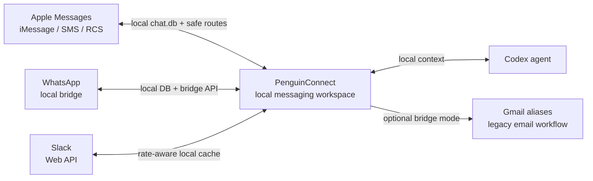

# PenguinConnect

[](./docs/PENGUIN_CONNECT.md)
[](./SECURITY.md)
[](./server/requirements.txt)
[](./LICENSE)

PenguinConnect is a local messaging control surface for searching, replying to, and managing Apple Messages, WhatsApp, and Slack conversations from your Mac. The macOS-only origin services bind to `127.0.0.1` and can run without Gmail. An optional bearer-protected MCP endpoint can be published through an HTTPS tunnel.

It also keeps the older Gmail bridge available for Slashy/email workflows, but the operator UI and CLI are designed to work directly against the local Messages cache and Apple Messages route-safety checks.


```mermaid
flowchart LR
    Messages["Apple Messages<br/>iMessage / SMS / RCS"] <-->|local chat.db + safe routes| Workspace["PenguinConnect<br/>local messaging workspace"]
    WhatsApp["WhatsApp<br/>local bridge"] <-->|local DB + bridge API| Workspace
    Slack["Slack<br/>Web API"] <-->|rate-aware local cache| Workspace
    Workspace <-->|local context| Codex["Codex agent"]
    Workspace -->|optional bridge mode| Gmail["Gmail aliases<br/>legacy email workflow"]
```

## Demo

<video src="https://github.com/hgaddipati1118/penguin-connect/raw/main/assets/PenguinConnect.mp4" controls width="100%"></video>

## Why PenguinConnect

- **Operate iMessage, WhatsApp, and Slack from one recency-sorted control surface.** Search conversations, contacts, attachments, and local message history, then reply through the original provider.
- **Manage threads locally.** Add private titles, notes, labels, muted/pinned/archived state, follow-up dates, saved views, and group-name context without changing the underlying Messages chat.
- **Clean up contacts from the same surface.** Search cached Contacts and unsaved participants, create missing contact cards, favorite people, save recipient lists, and jump from a person to related threads or messages.
- **Ask Codex with real thread context.** Build or run a local Codex prompt from recent messages, notes, tags, search results, contacts, and draft text.
- **Your message stores stay on your Mac.** No hosted service receives `chat.db` or the WhatsApp SQLite store. The local server binds to `127.0.0.1`; an authorized remote MCP client receives only the tool results it requests through the optional HTTPS tunnel.
- **Safe routing.** If Apple Messages route resolution is ambiguous, PenguinConnect does not send.

## Current Status

- Shipping source adapters: **Apple Messages** (`iMessage`, `SMS`, `RCS`), **WhatsApp**, and **Slack**
- Slack channels retain human-readable authors, keep the newest active thread open while collapsing older reply trees with a latest-reply preview, progressively reveal deep threads within the same bounded message window, download private images/files into an authenticated local cache only when previewed, support inline emoji reactions plus native edit/delete for your own messages, and can send or schedule replies back into the native Slack thread while preserving the exact clicked message as local quoted context
- WhatsApp conversations preserve native quoted replies, reconcile native reactions and edited/deleted messages from the local bridge, support inline reactions on exact cached messages, and expose native edit/delete only for messages owned by you (including WhatsApp's edit-window limit)
- Apple Messages rows can keep local quoted-reply context and visual nesting in Penguin; the outgoing text still uses Apple's regular send path because the local bridge has no native arbitrary-message reply API
- Downloaded and locally available images are OCR-indexed on the Mac with Apple's Vision framework, so screenshots become searchable without sending each image to Codex; processing is incremental, bounded, and cached by file version
- Primary operator surfaces: **local messaging workspace**, **power console**, **local CLI**, and **MCP server**
- Optional legacy bridge surface: **Gmail aliases**
- Additional adapter available: **Telegram**
- Runtime: macOS 13+; the packaged app installs its private Python runtime. Source-only
  development requires Python 3.11+ and `Terminal.app` with Full Disk Access.

Want to help add a new messaging adapter or improve the bridge? Reach out at [harsha@slashy.com](mailto:harsha@slashy.com) or open an issue.

## Highlights

- Local Messages UI for conversations, message history, contacts, media, replies, new-chat drafts, attachments, voice memos, and Codex prompts
- Scheduled sends for existing conversations through registered send adapters
- Per-conversation activity history records sends, schedules, snoozes, Penguin Agent actions, and manual notes without copying message bodies into the log
- Messages-only startup is allowed when Gmail is not connected
- Optional two-way sync between Apple Messages conversations and Gmail threads
- Optional active alias email per conversation
- Direct-message unification across sibling `iMessage`, `SMS`, and `RCS` routes
- Group chats stay separate per exact Apple Messages chat
- Incremental sync prioritizes currently active conversations while startup catch-up stays in background batches
- Optional Gmail-to-chat delivery sends net-new text only and strips quoted history aggressively
- Optional Gmail `UNREAD` labels mirror Apple Messages unread state at the conversation level
- Durable local SQLite queue and JSONL action log survive process restarts
- Ambiguous parsed replies are rejected visibly in Gmail instead of failing silently

## Quick Start

1. Copy `.env.example` to `.env`.
2. Install backend dependencies.
3. Start the local server.
4. Open the local messaging workspace.
5. Run verification.

```bash
cp .env.example .env

cd server
python3 -m venv venv
venv/bin/pip install -r requirements.txt
cd ..
```

```bash
./scripts/run_penguin_connect_bridge.sh
open http://127.0.0.1:9000/penguin-connect/ui
./scripts/check.sh
```

The default `/penguin-connect/ui` route is the focused iMessage + WhatsApp + Slack workspace. The existing
operator surface remains available at `/penguin-connect/console`.

The workspace explicitly discovers WhatsApp whenever it refreshes. For a headless Gmail sync
process that should also discover WhatsApp and Telegram before any UI or MCP request, set
`PENGUIN_CONNECT_DISCOVER_SECONDARY_CHANNELS_DURING_SYNC=true`.

For Slack, create an app from [`slack_manifest.example.json`](slack_manifest.example.json)
and install it into the intended workspace. The manifest requests user scopes for channel,
private-channel, DM, and group-DM read/history access plus `users:read`, `files:read`,
`search:read`, `chat:write`, and `reactions:write`. Copy the resulting `xoxp-` user token,
then store it without putting it in `.env`:

```bash
./scripts/penguin_connect_slack_auth.py --store-from-clipboard
./scripts/penguin_connect_slack_auth.py --status
```

Penguin reads that credential from macOS Keychain. `PENGUIN_CONNECT_SLACK_TOKEN` remains
available as a local development override.

If Penguin was installed before inline reactions were added, update the app from the
manifest and reinstall it once so Slack grants `reactions:write`, then store the replacement
user token with the same command above. Reading and replying continue to work while that
scope is absent; reaction attempts show the missing-scope guidance in the workspace.

### Native desktop app

Build the lightweight macOS app bundle, install it in Applications, and open it:

```bash
./scripts/build_desktop_app.sh --install
open -a Penguin
```

The app uses the same local-only workspace and starts the bridge when it is not already
running. Its embedded repository path is recorded at build time, so rebuild the app after
moving the checkout. Grant Full Disk Access to Penguin when the app starts the bridge
itself, or to Terminal when you run the bridge script there. The packaged app asks for
Contacts access once during setup under Penguin's native identity; its write helper runs as a
Penguin descendant and does not request approval for every contact action. An ad-hoc rebuild may look like a new app identity
to macOS and require that one-time grant again. Enabling remote MCP also registers Penguin's
native executable as a background item. It keeps the loopback bridge available after the window
closes and across login without opening Terminal; macOS may show the normal one-time Background
Items notification.

## Codex / MCP

PenguinConnect includes a local stdio MCP server with tools for:

- searching Mac Contacts, unsaved participants, cached messages, and native chats that are not yet in Penguin's rail
- Spotlight file search over configurable local folders
- optional hybrid semantic search using SQLite FTS5, `sqlite-vec`, and a local Ollama embedding model
- previewing and confirming sends through existing iMessage or WhatsApp routes
- sending WhatsApp messages to a new phone/JID, or staging a new addressed Apple Messages draft for human review

Register it with Codex after installing the backend dependencies:

```bash
codex mcp add penguin-connect -- \
  /absolute/path/to/penguin-connect/server/venv/bin/python \
  /absolute/path/to/penguin-connect/scripts/penguin_connect_mcp.py
```

Then run `codex mcp list` or use `/mcp` in Codex to verify the tools. Send tools use a
two-call preview/confirm flow. A new Apple Messages recipient is opened as an addressed draft
instead of being auto-sent because PenguinConnect does not guess an unverified Apple route.

### Authenticated remote MCP over HTTPS

Penguin can create a bearer-protected Streamable HTTP endpoint that Slashy and other MCP
clients can use while the Mac is online. The origin services stay on `127.0.0.1`; Tailscale
Funnel supplies a stable public HTTPS address by default. Never port-forward Penguin, MCP port
`8765`, WhatsApp API port `8080`, or pairing port `8081`.

The one-command setup installs launch-at-login services, saves two independent high-entropy
secrets only in macOS Keychain, and copies a Slashy-compatible connection bundle to the
clipboard. The wire credential also includes a six-character code that rotates each local day:

```bash
open https://tailscale.com/download/mac
./scripts/penguin_connect_remote_setup.py --profile slashy
```

Install and sign in to the Tailscale Mac app before running the command. Penguin uses a
dedicated public HTTPS port (`10000`) and does not expose any other local service. For a
no-account temporary URL, use `--tunnel cloudflare-quick`; the release app bundles
`cloudflared` for that fallback.

In Slashy MCP Settings, choose **Add MCP server**, then paste the copied JSON into the custom
server field. Slashy fills the HTTPS URL and masked API-key field from `server_url` and `token`.
The command never prints the token. Later, copy the bundle again or inspect the non-secret
endpoint with:

```bash
./scripts/penguin_connect_remote_setup.py --copy
./scripts/penguin_connect_mcp_auth.py --copy-daily-code
./scripts/penguin_connect_remote_setup.py --status
```

Three built-in profiles are available:

| Profile | Providers | Remote tools |
| --- | --- | --- |
| `read-only` | iMessage + WhatsApp | capabilities, message search/read, contact search |
| `slashy` | iMessage + WhatsApp | read-only tools plus message send, contact upsert, and group creation |
| `whatsapp` | WhatsApp only | legacy `search_whatsapp` and `send_whatsapp` tools |

The default when no valid policy is present remains the original WhatsApp-only surface. No
remote profile exposes file search, index administration, attachment sending, or local paths.
Every MCP request requires the long install bearer plus today's six-character access code.
The app shows and copies the code locally; copying the connection bundle includes today's code,
and yesterday's bundle fails authentication after local midnight. The code alone is never
accepted. Wrong daily-code guesses are rate limited. Writes additionally need a five-minute,
one-use confirmation bound to the exact payload. Exact existing iMessage conversations can
send; a brand-new one-person destination is staged in Messages for human review. WhatsApp
groups can be created from exact phone numbers or user JIDs after that confirmation. New
iMessage groups are also staged by default, or can be created with a first message when the Mac
owner explicitly connects the optional loopback-only BlueBubbles Private API backend.

The macOS app exposes a native **Penguin Setup…** assistant that handles permissions,
loopback-only WhatsApp QR pairing, access-profile selection, endpoint creation, key rotation,
and Slashy handoff. The release build bundles `cloudflared`, the WhatsApp bridge, and its
Python runtime installer.
See [Packaging and distribution](docs/DISTRIBUTION.md) for release signing and first-run details.

#### Optional native iMessage group creation

Penguin does not bundle or silently install BlueBubbles. If the Mac owner already runs
[BlueBubbles Server](https://github.com/BlueBubblesApp/bluebubbles-server) with its
[Private API](https://docs.bluebubbles.app/private-api/installation), **Penguin Setup…** can
connect to its local server. This is an advanced opt-in: BlueBubbles documents that its Private
API requires disabling System Integrity Protection so it can inject a helper into Messages.
That weakens protection on the Mac and is unnecessary for reads, existing-chat sends, or
addressed drafts.

Penguin accepts only a loopback BlueBubbles URL such as `http://127.0.0.1:1234`, stores the
server password in macOS Keychain, and never publishes the BlueBubbles port through Tailscale or
Cloudflare. The password travels to the setup helper over stdin, not in command-line arguments,
environment variables, config files, or logs. CLI setup is also available by copying the
BlueBubbles server password and running:

```bash
./scripts/penguin_connect_bluebubbles.py --configure http://127.0.0.1:1234
./scripts/penguin_connect_bluebubbles.py --status
```

Native creation requires at least two exact participant identifiers and a non-empty first
message. The one-use MCP confirmation is bound to those participants, the group name, the first
message, and the selected backend. If the backend changes or becomes unavailable between preview
and confirmation, Penguin fails closed instead of silently switching behavior.

#### Stable and temporary hostnames

The default Tailscale Funnel URL is derived from the Mac's stable `ts.net` device name and
survives Penguin and Mac restarts. Funnel terminates TLS before proxying only to Penguin's
loopback MCP origin; Penguin's bearer authentication and capability policy still apply.
Tailscale documents Funnel's public-internet behavior and macOS requirements in its
[official Funnel guide](https://tailscale.com/kb/1223/funnel).

Cloudflare Quick Tunnel remains convenient for testing, but its hostname changes if the tunnel
or Mac restarts. When that happens, rerun setup with `--tunnel cloudflare-quick` and replace the
connection in Slashy. Do not present a Quick Tunnel as a durable production URL.

Advanced users who own a Cloudflare-managed domain can instead create a named Cloudflare
Tunnel and DNS route:

```bash
cloudflared tunnel login
cloudflared tunnel create penguin-connect-mcp
cloudflared tunnel route dns penguin-connect-mcp mcp.example.com
```

Create `~/.cloudflared/config.yml`, substituting the tunnel UUID, credentials path, and
hostname:

```yaml
tunnel: 00000000-0000-0000-0000-000000000000
credentials-file: /Users/you/.cloudflared/00000000-0000-0000-0000-000000000000.json
ingress:
  - hostname: mcp.example.com
    service: http://127.0.0.1:8765
    originRequest:
      httpHostHeader: 127.0.0.1:8765
  - service: http_status:404
```

Run the installer with the named tunnel and public origin exported. The launch agent records
these non-secret settings, while credentials remain in Cloudflare's config directory:

```bash
PENGUIN_CONNECT_CLOUDFLARE_TUNNEL=penguin-connect-mcp \
PENGUIN_CONNECT_PUBLIC_MCP_URL=https://mcp.example.com \
  ./scripts/penguin_connect_remote_setup.py --profile slashy --tunnel cloudflare-quick
```

To connect a client manually, copy today's composed access token through a password manager:

```bash
./scripts/penguin_connect_mcp_auth.py --copy
```

On the client, load the token without putting it in shell history, then register the HTTPS
endpoint:

```bash
read -rsp "Penguin MCP token: " PENGUIN_CONNECT_REMOTE_MCP_TOKEN; echo
export PENGUIN_CONNECT_REMOTE_MCP_TOKEN
codex mcp add penguin-connect-remote \
  --url https://mcp.example.com/mcp \
  --bearer-token-env-var PENGUIN_CONNECT_REMOTE_MCP_TOKEN
```

The copied value contains the long bearer plus today's rotating code and can read every provider
enabled by its profile. Treat it like a password, give it only to the intended MCP host, and
refresh it after local midnight. Per-tool toggles in Slashy provide another useful boundary.

Rotate the bearer immediately with `./scripts/penguin_connect_mcp_auth.py --rotate` if it may
have been exposed. The server does not print the token or place it in its launchd plist.

Quick Tunnels are suitable only for a temporary test. For an endpoint that stays up, use a
named tunnel on a hostname you control and add Cloudflare Access or another ingress policy
when your MCP client supports it. Keep the application bearer check as defense in depth.

File search uses the macOS Spotlight index and returns paths plus metadata, not file contents.
By default it searches Desktop, Documents, and Downloads. Override the roots with a
path-separated `PENGUIN_CONNECT_FILE_SEARCH_ROOTS` value.

For optional semantic search:

```bash
brew install ollama
ollama pull nomic-embed-text
```

Call the MCP `rebuild_local_search_index` tool with `semantic=true` and `confirm=true`.
Without Ollama or `sqlite-vec`, PenguinConnect continues to provide exact contact/message
search, Spotlight file search, and SQLite FTS5 search.

The attachment library also extracts searchable text from locally available documents and
images. Image OCR uses Apple's Vision framework entirely on the Mac and compiles a small
cached helper on first use. Private Slack or WhatsApp media is processed only after the
authenticated local bridge downloads it for preview.

For the full Gmail bridge setup, run `./scripts/penguin_connect_setup.py --gmail you@gmail.com`. During guided setup, the wizard also offers an interactive Apple Messages chat exclusion step and saves selections in `./.penguin_connect_excluded_chats.json` by default.

Important: run setup and bridge commands from `Terminal.app` with Full Disk Access enabled, otherwise Apple Messages `chat.db` reads will fail.

Codex helper auth is local to the same Mac. To use ChatGPT/Codex subscription access, install the Codex CLI and run `codex login`; PenguinConnect detects the local CLI session and does not read or store Codex tokens. Trusted Business/Enterprise workflows can also use `CODEX_ACCESS_TOKEN` or `codex login --with-access-token`.

The workspace sidebar can also read the Slashy coordination root and configured tools such
as Supabase. Read mode is sandboxed. Modes that edit repositories or prepare pull requests
require explicit confirmation for every run, preserve existing dirty work, and instruct
Codex to commit only its own changes so the result remains reversible. Override the
coordination root with `PENGUIN_CONNECT_CODEX_WORKSPACE`.

## Useful Commands

Start the bridge:

```bash
./scripts/run_penguin_connect_bridge.sh
```

Alternative start wrapper:

```bash
./start.sh
```

Health check:

```bash
curl -s http://127.0.0.1:9000/penguin-connect/health | jq
```

Local Messages operation notes:
- Leave `PENGUIN_CONNECT_INCREMENTAL_CONVERSATIONS_PER_RUN` unset to let incremental runs expand to all currently hot conversations up to the built-in cap.
- Set `PENGUIN_CONNECT_INCREMENTAL_CONVERSATIONS_PER_RUN` if you want to clamp each incremental batch manually.
- Startup catch-up runs in small background batches so recent-message incremental sync can keep getting worker time.
- `PENGUIN_CONNECT_ALLOW_MISSING_GMAIL_STARTUP` defaults to allowing local Messages-only startup when Gmail is not connected.

Optional Gmail bridge notes:
- While startup catch-up or backfill is importing iMessage history, the worker now yields after every 5 Gmail imports if a queued incremental job is waiting.
- Preempted startup/backfill conversation imports resume from the saved Apple Messages cursor instead of rescanning from the beginning.
- Gmail writes now flow through a per-account quota budget, and startup/backfill can only spend the smaller backfill bucket so incremental work keeps reserved headroom.
- Repeated Gmail rate limits now slow startup/backfill automatically by extending the cooldown window and increasing the per-write pause until successful syncs recover.
- Startup/backfill also stop after a rolling 24-hour Gmail import cap and stand down for a longer pause once the Gmail rate-limit streak gets too high, so old-history catch-up cannot keep hammering the account while incremental work waits.

Production-style preflight:

```bash
./scripts/check.sh
./scripts/penguin_connect_doctor.py
```

Install login auto-start for the loopback bridge:

```bash
./scripts/install_launchd_penguin_connect_bridge.sh
```

That installer registers Penguin's native app executable as a persistent background launch
agent. The app directly owns the bridge process so its one-time Full Disk Access grant remains
the relevant macOS privacy identity. It binds only to `127.0.0.1`, never opens Terminal, and
waits rather than killing anything already listening on the configured port. If you later
change `PENGUIN_CONNECT_PORT`, rerun the installer so the launch agent follows the new port.

Quote-parsing audit:

```bash
./scripts/penguin_connect_audit_quote_parsing.py --limit 100
```

Manage excluded Apple Messages chats:

```bash
./scripts/penguin_connect_excluded_chats.py
```

Local operator CLI for search, messages, sends, contacts, and group drafts:

```bash
open http://127.0.0.1:9000/penguin-connect/ui
./scripts/penguin_connect_tool.py status
./scripts/penguin_connect_tool.py search "Taylor" --source both
./scripts/penguin_connect_tool.py message-search "dinner plan" --source both
./scripts/penguin_connect_tool.py messages CONVERSATION_ID --limit 25
./scripts/penguin_connect_tool.py send CONVERSATION_ID --message "On it"
./scripts/penguin_connect_tool.py send CONVERSATION_ID --attachment ~/Desktop/voice-memo.m4a
./scripts/penguin_connect_tool.py schedule CONVERSATION_ID --at "2026-07-01T16:30:00-07:00" --message "On it later"
./scripts/penguin_connect_tool.py scheduled list CONVERSATION_ID
./scripts/penguin_connect_tool.py scheduled cancel SCHEDULED_ID
./scripts/penguin_connect_tool.py scheduled retry SCHEDULED_ID
./scripts/penguin_connect_tool.py contacts search "Taylor"
./scripts/penguin_connect_tool.py contacts create --first Taylor --phone +14155550101
./scripts/penguin_connect_tool.py contacts refresh
./scripts/penguin_connect_tool.py group compose --participant +14155550101 --participant friend@example.com --message "Starting this thread" --copy --open-addressed
```

The `send` and `schedule` commands route directly through an existing PenguinConnect conversation
and keep the normal Apple Messages route-safety checks; Gmail is not required
for local manual sends. They can also attach local files, including audio voice
memos. Failed offline sends stay visible in the Queue and selected conversation
with an explicit retry action; reconnecting Gmail is not required for those
source-native sends. The local UI supports replies, scheduled sends for existing conversations, file/image attachments from picker, drag/drop, or paste, in-composer
voice memo recording, emoji
shortcuts, visible-page auto-refresh with new-activity status for cached conversations
and the selected thread, message-level reply targets and copy actions, thread filtering and unknown-first sorting,
needs-reply/unread/direct/groups/unknown-participant/favorite-participant/drafts/unlabeled/muted/pinned/archived and label-based conversation views, favorite-person and unknown-first sorting, visible unknown-thread selection, bulk
mark-read/mark-unread/pin-unpin/mute-unmute/archive-restore/label add-remove, selected-thread summary copy, selected-people add/copy/save/star/unstar/create, and draft cleanup actions, latest-message previews in the conversation rail,
highlighted conversation search with saved rail views, SlashyEmail-style keyboard shortcuts and help overlay for compose/search/view jumps/panels/contact filters/thread actions/message and media filters, and keyboard result navigation,
global synced-message search with saved message-search views, keyboard result navigation, exact-hit thread opening that loads older message windows as needed, and highlighted note/attachment-aware results, recent-message browsing, open/copy/reply actions and filters for current thread, unread, sent,
files and audio plus date ranges, highlighted loaded-message filters with keyboard result navigation, next-unread/latest-message jumps, and focused-message reply/copy/draft/star/read/note actions for sender/body/notes/attachments and unread/sent/files/audio,
starred/noted-message filtering, local message starring and private
message notes, per-message read/unread toggles, sender-history Find and thread-filter actions, visible loaded-message copy and bulk star/read/unread actions, opening synced attachment files, a per-thread media browser for loaded
images/audio/files, inline previews for local image attachments, inline playback
for local audio attachments, on-demand Download cards for WhatsApp media that
is known to the bridge but not stored on the Mac, highlighted cached Contacts search/refresh with saved/unsaved/threaded/direct/group/unread/needs-reply/follow-up/favorite/noted/phone-handle/email-handle
source filters with counts, contact thread, needs-reply, follow-up, and unread activity metadata, contact sorting including recent-activity, needs-reply-first, follow-up-first, unread-first, threads-first triage, and next unread/needs-reply/follow-up visible-contact jumps, saved contact-search views, all/saved/unsaved contact browsing, conversation-participant fallback and related-thread shortcuts with unread/source context,
thread-name, cached-message, and local-management-aware contact/participant search with highlighted related-thread label/note/message context and keyboard result navigation, contact-to-thread rail filtering and matching-message focus, private contact notes with note-aware search, contact creation, contact-to-thread matching, saved-contact resolution for
selected-thread participants, single and bulk copyable contact detail dossiers, copyable/searchable recent contact history with thread filters, click-to-draft contact starts, contact-to-new-chat recipient picking with visible-result bulk add/copy/save, thread-filter, and message-search actions,
selected/visible contact bulk favorite and unfavorite actions,
removable recipient chips, reusable saved recipient lists, selected-thread participant actions for contact
search, thread filtering, local Messages search, new-chat, and contact creation, participant favoriting, bulk add-all, copy-all, and save-as-list actions, local thread titles, notes, tags and muted state,
native Messages group-name context whenever a local title differs plus one-click local-title restore from the native group name,
rail-level quick reply, visible-thread next unread/needs-reply/follow-up jumps, pin/mute/archive/read-unread actions, follow-up scheduling/filtering with quick presets from threads or message rows, quick message-row labels plus bulk follow-up set/clear, read/unread management, local route
disconnect/reconnect controls, persistent per-thread reply drafts, bounded IndexedDB
workspace snapshots that restore the remembered thread first and hydrate adjacent threads
during browser idle time, new chat
draft staging with keyboard-navigable contact suggestions, live Messages-ready draft preview, Cmd/Ctrl+Enter keyboard submit, copy-recipients/copy-body/copy-draft actions,
addressed Messages compose links, and a Codex prompt helper with
reply, summary, follow-up, contact-cleanup, and custom-question modes that can
copy or run a local `codex exec` prompt over recent thread context, search
results, contact results, local notes, tags, new-chat drafts, and your reply draft, then place the
answer into the reply draft for review. Use `message-search` to search cached
message bodies in the local database, or search Apple Messages text directly with the
`--source imessage` or `--source both` options. The `messages` command shows
imported attachment summaries, including audio attachments from Apple Messages.
The group command stages a new Messages draft instead of auto-sending, because
Messages exposes reliable scripting for existing chats but not for creating a
brand-new group chat by API.

Automated browser sessions are hard read-only. The outbound API also rejects local
Penguin UI/console links so a QA URL cannot escape into iMessage, WhatsApp, or Slack.

## Safety Model

- Local-only runtime on `127.0.0.1`
- `conversation_id` is the primary logical identity
- Apple Messages direct messages may unify across sibling routes; group chats stay separate
- Exact Apple Messages route resolution must succeed before send
- Optional Gmail-to-chat parsing fails closed when reply text is still ambiguous
- Action logging stores identifiers, timestamps, statuses, and message fingerprints, not raw message text

The default action log path is `~/penguinconnect-local-bridge-data/actions.jsonl`.

## Optional Reply Cleanup Markers

Set `PENGUIN_CONNECT_SIGNATURE_MARKERS_FILE` to point at a local JSON file with custom signature or disclaimer prefixes. If unset, PenguinConnect reads `./.penguin_connect_signature_markers.json` by default. An example file lives at [`signature_markers.example.json`](./signature_markers.example.json).

## Optional Chat Exclusions

Set `PENGUIN_CONNECT_EXCLUDED_CHATS_FILE` to point at a local JSON file with Apple Messages chats or logical conversations that PenguinConnect should skip. If unset, PenguinConnect reads `./.penguin_connect_excluded_chats.json` by default. An example file lives at [`excluded_chats.example.json`](./excluded_chats.example.json), and the interactive manager is [`scripts/penguin_connect_excluded_chats.py`](./scripts/penguin_connect_excluded_chats.py).

## Repository Guide

- How threading works: [`docs/HOW_THREADING_WORKS.md`](./docs/HOW_THREADING_WORKS.md)
- How syncing, backfill, and rate limits work: [`docs/HOW_SYNCING_WORKS.md`](./docs/HOW_SYNCING_WORKS.md)
- Full setup, troubleshooting, and operations: [`docs/PENGUIN_CONNECT.md`](./docs/PENGUIN_CONNECT.md)
- Contributing guide: [`CONTRIBUTING.md`](./CONTRIBUTING.md)
- Security reporting: [`SECURITY.md`](./SECURITY.md)
- Code of conduct: [`CODE_OF_CONDUCT.md`](./CODE_OF_CONDUCT.md)
- Agent instructions: [`AGENTS.md`](./AGENTS.md)
- License: [`LICENSE`](./LICENSE)

## Project Layout

- [`server/`](./server): FastAPI app, sync logic, local DB, tests
- [`server/channels/`](./server/channels): provider adapters for Apple Messages, WhatsApp, Slack, and Telegram
- [`scripts/`](./scripts): setup, doctor, sync, audit, and launch helpers
- [`docs/`](./docs): setup, troubleshooting, and operations notes
- [`skills/`](./skills): repo-local guidance for coding agents and future channel integrations
